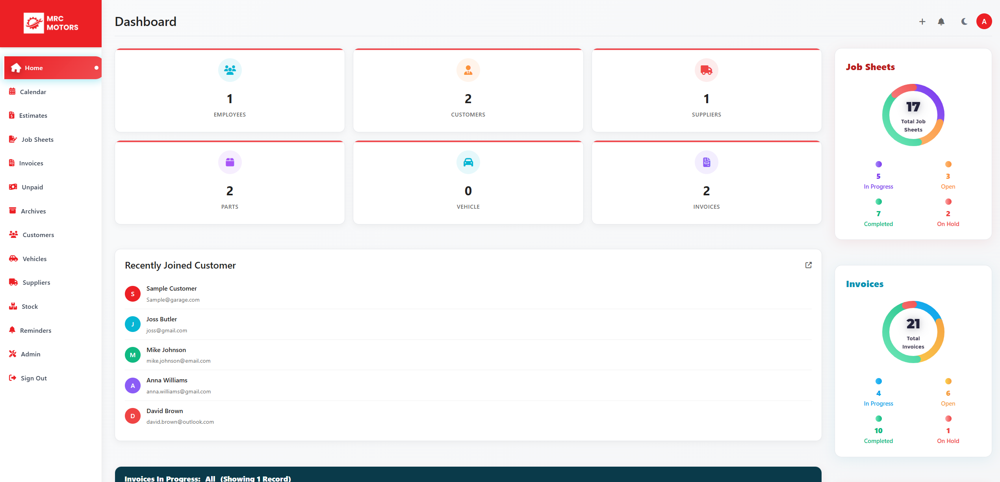
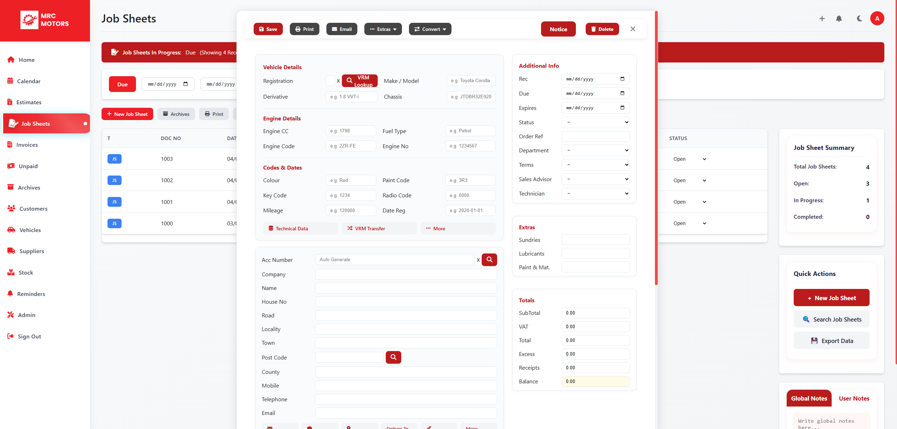
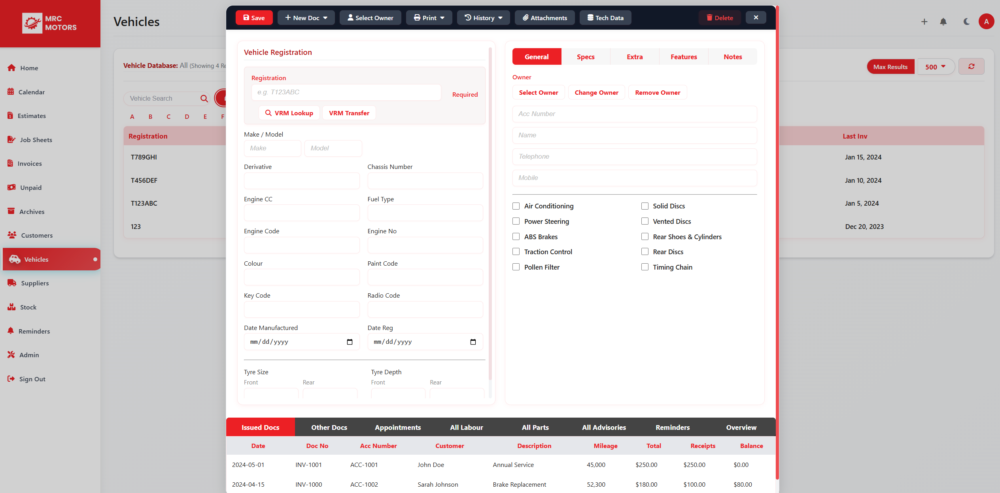
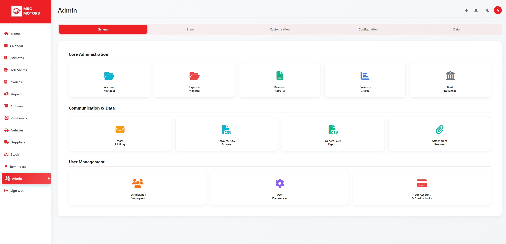
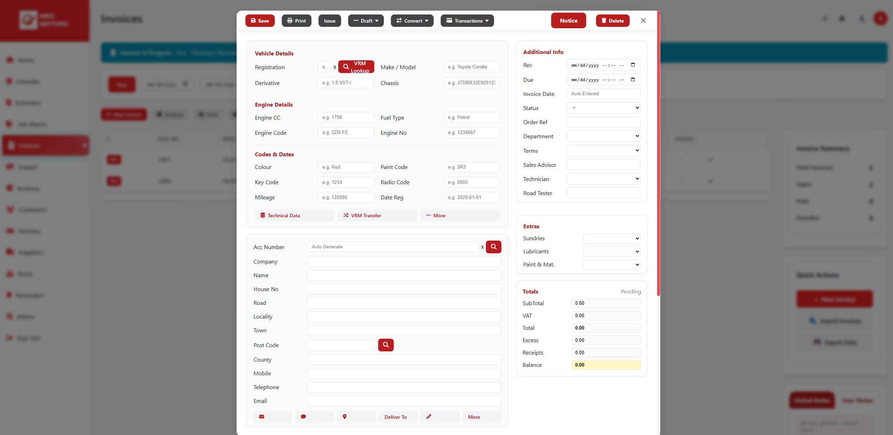

<div align="center">

# 🚗 Garage Management System

**A modern, full-featured garage & workshop management platform for automotive repair shops and service centers.**

[](https://php.net)
[](./README.md)

*Dashboard • Estimates • Job Sheets • Invoices • Customers • Vehicles • Stock • Calendar*

</div>

---

## 📸 Screenshots

| | | |
|:-------------------------:|:-------------------------:|:-------------------------:|
|  |  |  |
| **01 — Dashboard** | **02 ** | **03** |
|  |  | |
| **04** | **05** | |

---

## ✨ Features

- **Dashboard** — Real-time stats, recent customers, and quick actions  
- **Calendar** — Appointments, documents, and scheduling  
- **Estimates** — Create and manage repair estimates  
- **Job Sheets** — Work orders and job tracking  
- **Invoices** — Billing, unpaid tracking, and archives  
- **Customers** — CRM with search and filtering  
- **Vehicles** — Vehicle registry and service history  
- **Suppliers & Stock** — Inventory and supplier management  
- **Reminders** — Follow-ups and notifications  
- **Admin** — System and user management  

**UI/UX:** Responsive layout, clean components, optional dark mode, and print/export support.

---

## 🛠 Tech Stack

- **Backend:** PHP  
- **Frontend:** HTML, CSS, JavaScript  
- **Assets:** Font Awesome, modular CSS (base, layout, components, styles)  
- **Structure:** PHP includes, config-driven titles and navigation  

---

## 📁 Project Structure

The repo uses a **clear, include-based layout**: page entry points in the root, shared layout in `partials/`, feature modals in `Popups/` (grouped by area), and static assets in `Assets/`. No framework lock-in—just PHP, CSS, and JS that are easy to deploy and navigate.

```
├── Assets/
│   ├── CSS/          # base, layout, components, styles, admin, calendar
│   ├── JS/           # core, script, admin, calendar, database
│   └── img/          # screenshots (01–05) and other assets
├── partials/         # layout: header, sidebar, footer + reusable widgets
├── Popups/           # modals by feature (calendar, customers, estimates, invoices, job-sheets, stock, suppliers, admin)
├── docs/             # internal docs (README, popup structure)
├── config.php        # app config, base URL, header/footer helpers
├── index.php         # dashboard
├── calendar.php      # calendar & scheduling
├── estimates.php     # estimates
├── job-sheets.php    # job sheets
├── invoices.php      # invoices
├── unpaid.php        # unpaid tracking
├── archives.php      # archives
├── customers.php     # customers
├── vehicles.php      # vehicles
├── suppliers.php     # suppliers
├── stock.php         # stock
├── reminders.php     # reminders
├── admin.php         # admin
├── signout.php       # sign out
├── calendar_backup.php   # reference backup (optional; can exclude via .gitignore)
└── .htaccess         # Apache: compression, cache, security headers
```

---

## 🚀 Getting Started

1. **Requirements:** PHP 7.4+ and a web server (Apache with mod_rewrite, or PHP built-in server).
2. **Clone the repo:** `git clone https://github.com/japhry/garage-management-system.git`
3. **Point your document root** to this folder (or run `php -S localhost:8000` for quick testing).
4. **Open** `index.php` in the browser (e.g. `http://localhost:8000/`).

No database is required for the current UI; add `.env` and config as needed for future backend integration.

---

## 📫 Connect

| | |
|:---|:---|
| 🌍 **Portfolio** | [https://pixellinx.co.tz](https://pixellinx.co.tz) |
| 📧 **Email** | [info@pixellinx.co.tz](mailto:info@pixellinx.co.tz) |

---

<div align="center">

**Garage Management System** — *Built for workshops that mean business.*

</div>
